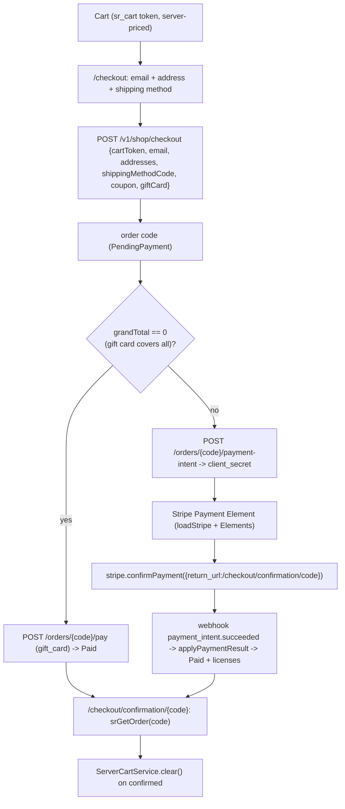

# Plan — Storefront checkout-flow migration (Vendure/NMI → SellRight/Stripe)

> **Scope honesty:** this is the conversion path AND a payment-gateway change. The design below is world-class and buildable, but the **live Stripe payment leg cannot be verified autonomously** (needs live Stripe test keys on the box + a browser + a test card + Adrian's eyes on the checkout UX). Treat implementation as: build-verified + committed behind the existing `VITE_SERVER_CART`/a `VITE_SR_CHECKOUT` flag, with a **mandatory human verification gate** (one real test-mode transaction) before it's trusted. This is the one place in the SellRight build where "don't wait unless blocker" yields to "a payment path needs human eyes."

**Goal:** Replace the cloned DD storefront's Vendure checkout (incremental `activeOrder` + NMI/Sezzle via `addPaymentToOrder`) with SellRight's REST checkout: a single server-priced `POST /v1/shop/checkout` from the `sr_cart` token, a Stripe **PaymentIntent**, client-side confirmation via Stripe **Payment Element**, webhook settlement, and a confirmation page read by order code.

**Architecture:** The server cart (pass 1 `ServerCartService`, `sr_cart` cookie) is already the source of truth. Checkout becomes: collect email + shipping/billing address + shipping method → `POST /checkout {cartToken, email, shippingAddress, billingAddress, shippingMethodCode, couponCode, giftCardCode}` → order `code` → `POST /orders/{code}/payment-intent` → `client_secret` → mount the Stripe **Payment Element**, `stripe.confirmPayment()` → on success redirect to `/checkout/confirmation/{code}` → `srGetOrder(code)` renders the receipt. Settlement is authoritative via the existing `payment_intent.succeeded` webhook (the confirmation page tolerates "payment processing" until the webhook lands). **NMI + Sezzle are removed** (SellRight settles via Stripe + gift-card tender only).

**Visual Plan — checkout flow**

**Tech stack:** Qwik storefront; **`@stripe/stripe-js`** (loadStripe + Elements/Payment Element — new dep); SellRight REST (`sellright.ts` already has `srCreateOrder`, `srPayOrder`, `srGetOrder`; ADD `srCreatePaymentIntent`, `srStripePublishableKey`). Backend: Hono (verify `/orders/{code}/payment-intent` returns `client_secret` + the publishable key is fetchable; `/v1/shop/orders/{code}` readable for the confirmation page).

---

## ADR (decisions taken)
- **Outcome** — a shopper completes purchase end-to-end against SellRight with a card; licenses issue via the existing settle path. Success: create→pay→confirmation renders the order; webhook settles; cart clears. Non-goals: NMI/Sezzle (removed), saved-card/wallet (later), Apple/Google Pay (later, Payment Element supports it when enabled).
- **Decision** — single server-priced `POST /checkout` from the cart token (NOT incremental order building) + Stripe **Payment Element** (not the legacy Card Element; Payment Element is the current Stripe standard and enables wallets later) + webhook-authoritative settlement.
- **Alternatives rejected:** (a) keep NMI/Sezzle — SellRight has no NMI provider; (b) Stripe Checkout (hosted redirect) — loses the on-site checkout UX the DD theme is built around; (c) incremental order mutations — Vendure-ism, not how SellRight models a cart→order.
- **Riskiest assumption** — `/orders/{code}/payment-intent` returns a usable `client_secret` and the webhook reliably settles. **Smallest test:** one Stripe **test-mode** transaction (4242 card) on the box → order goes `PendingPayment`→`Paid`, license issued, confirmation renders. **This is the human gate.**
- **Blast radius** — checkout + payment + confirmation pages; behind a `VITE_SR_CHECKOUT` flag so the Vendure path stays default until verified. **Reversibility:** flag off restores the current flow (the Vendure providers are not deleted until the flag is proven, only superseded).
- **SSR-cookie wrinkle** — checkout + payment are **client-rendered** (cart token + Stripe Element are browser-only); the confirmation page reads the order **by code** (`srGetOrder`). No authenticated-SSR dependency on the hot path.
- **P1 security (council) — confirmation order access:** an order `code` is `SR`+10 hex (~enumerable), so `/v1/shop/orders/{code}` must NOT be readable by bare code (PII/enumeration leak). The order read must be **scoped**: either (a) the authenticated customer owns it, OR (b) a short-lived high-entropy **receipt token** returned by `POST /checkout` (e.g. `?rt=<token>` carried to the confirmation URL + the Stripe `return_url`), OR (c) the `sr_cart` cookie that converted into the order. Verify the existing `/v1/shop/orders/{code}` auth in Task 1; if it's bare-code, add the receipt-token grant before using it on the confirmation page.

---

## File map
| File | Change | Responsibility |
|---|---|---|
| `packages/storefront/package.json` | edit | add `@stripe/stripe-js` |
| `packages/storefront/src/utils/sellright.ts` | edit | `srCreatePaymentIntent(code)` → `{clientSecret}`, `srStripePublishableKey()` |
| `packages/storefront/src/providers/shop/checkout/checkout.ts` | rewrite | drop NMI/Sezzle/transition/addPayment; export `placeOrder(form)` (→ `/checkout`), `createPaymentIntent(code)`, `payWithGiftCardOnly(code)` |
| `packages/storefront/src/hooks/useCheckout.ts` | rewrite | orchestrate cart-token → place → (gift-card-paid OR payment-intent) → Stripe confirm; expose state machine (idle/placing/paying/error) |
| `packages/storefront/src/components/checkout/StripePaymentElement.tsx` | new | loadStripe + `<Elements>` + Payment Element + `confirmPayment` |
| `packages/storefront/src/routes/checkout/index.tsx` | edit | use the new hook + address/shipping from REST (`srShippingMethods`); render the Stripe element |
| `packages/storefront/src/routes/checkout/payment/index.tsx` | edit/remove | fold into the single-page flow or repoint to the Payment Element |
| `packages/storefront/src/routes/checkout/confirmation/[code]/index.tsx` | edit | `srGetOrder(code)`; tolerate not-yet-settled (poll/"processing"); clear `ServerCartService` |
| `packages/storefront/src/services/{PaymentService,ShippingService}.ts` | edit | Shipping→`srShippingMethods`; Payment→Stripe-only (drop NMI/Sezzle method lists) |
| `packages/api/src/routes/pay.ts` | verify/edit | confirm `/payment-intent` returns `client_secret`; expose publishable key (or add `/v1/shop/stripe-key`) |
| `packages/api/src/routes/checkout.ts` (orders by code) | verify | `/v1/shop/orders/{code}` readable for the confirmation receipt (by-code access for the placing session) |

---

## Tasks (TDD where pure; build-gated throughout; behind `VITE_SR_CHECKOUT`)
1. **Backend verify/enrich** — read `pay.ts` `/payment-intent` + `/pay`; confirm `client_secret` is returned and the publishable key is fetchable (add `GET /v1/shop/stripe-key` if not). Confirm `/v1/shop/orders/{code}` returns the receipt shape (`SrOrder`) for the placing session. Add tests for any new endpoint.
2. **`sellright.ts`** — `srCreatePaymentIntent(code)`, `srStripePublishableKey()`.
3. **Checkout provider rewrite** — `placeOrder(form)`/`createPaymentIntent`/`payWithGiftCardOnly`; delete NMI/Sezzle exports.
4. **`StripePaymentElement.tsx`** — `loadStripe(pk)`, `<Elements clientSecret>`, Payment Element, `confirmPayment({ return_url })`.
5. **`useCheckout` rewrite** — state machine; gift-card-only short-circuit (`grandTotal==0 → /pay`); else PI → confirm.
6. **Checkout page + confirmation** — wire address/shipping from REST; confirmation polls `srGetOrder` until `Paid` (webhook lag) then clears the cart.
7. **Remove NMI/Sezzle** — providers, components, method lists, env. Grep clean.
8. **Build gate** — `pnpm build` green. **Human gate (cannot self-do):** one Stripe test-mode transaction on the box → Paid + license + confirmation.

---

## Review gates
- **/council:** PROCEED-WITH-REFINE → confirmation order-access scoped (not bare-code).
- **/jury jury-plan (4 jurors):** NEEDS-REVISION (avg 5.8) → resolved:
  - *Receipt-token "verify in Task 1" is not a mechanism* → **made concrete (Task 1):** `POST /checkout` returns a high-entropy `receiptToken` (32-byte base64url, stored on the order); `GET /v1/shop/orders/{code}?rt=<token>` grants read when the token matches OR the authed customer owns the order — never bare-code. The Stripe `return_url` and the confirmation route carry `?rt=`.
  - *PaymentIntent idempotency* → `POST /orders/{code}/payment-intent` is idempotent: if the order already has an open PI, return its `client_secret` (reuse) instead of creating a second; pass a Stripe idempotency key keyed on the order id. Prevents duplicate PIs on double-click/retry.
  - *No autonomous verification of the payment leg* → **mock-Stripe test harness (Task 1):** unit/DB tests cover PI creation (mocked Stripe returns a client_secret + idempotent reuse) and the `payment_intent.succeeded` webhook → `Paid` + license issued. This autonomously covers everything EXCEPT the real-card UI confirm, which is the irreducible human gate (a real test-mode card in a browser — not autonomously doable).
  - *Webhook monitoring* → each payment/subscription webhook writes an `auditLog` row; Stripe's failed-webhook dashboard is the alerting surface at one-operator scale (metrics counter named, deferred).
  - *client_secret / publishable key* → the publishable key is public-by-design (client-side); serve it from a normal API response (not a publicly-cached CDN edge). `client_secret` is per-PI and only returned by the order-scoped (token/auth) `/payment-intent` endpoint — never logged.
  - *API schema versioning* → all changes are additive (`receiptToken` column, new endpoints); no breaking change to existing `/checkout`.
- Then implement behind `VITE_SR_CHECKOUT`, build-verify, commit — and **STOP at the human test-transaction gate** (do not flip the flag to default until Adrian runs one Stripe test-mode purchase and eyes the checkout UX).

### Critical Files for Implementation
- `packages/storefront/src/hooks/useCheckout.ts` (the flow state machine)
- `packages/storefront/src/components/checkout/StripePaymentElement.tsx` (the payment integration)
- `packages/storefront/src/providers/shop/checkout/checkout.ts` (REST checkout/PI/gift-card)
- `packages/storefront/src/routes/checkout/confirmation/[code]/index.tsx` (receipt + cart clear + webhook-lag tolerance)
- `packages/api/src/routes/pay.ts` (payment-intent client_secret + publishable key)
