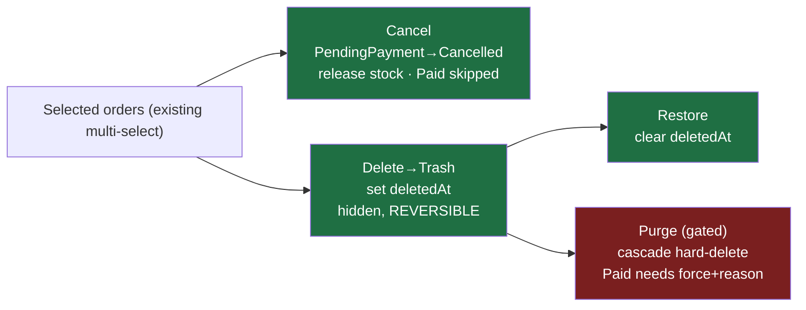

# Plan — Order management: bulk cancel / soft-delete (trash) / restore / purge (SellRight)

**Goal:** Give the operator a safe, reversible-by-default way to clear orders in bulk from the admin Orders page — cancel unpaid orders, trash/restore (soft-delete), and permanently purge — closing the "no way to bulk-delete orders" gap.

**Architecture:** Build in **SellRight** (the commerce product); RightApps absorbs it via the upstream merge. Reuse the existing bulk pattern (`POST /v1/admin/orders/bulk-fulfill` in `admin.ts` — dedup → per-order `withStore` → `{results, succeeded, skipped}` + `auditLog`), the FSM (`canTransition`, `Cancelled` already exists), and the established soft-delete convention (`deletedAt`, as on product/variant). The only schema change is an additive `order.deletedAt`. The admin Orders page already has multi-select + a bulk toolbar + a per-row result panel — we add buttons + a Trash view.

**Visual Plan: "four actions, three risk tiers"**



| Action | Endpoint | Reversible? | Guard |
|---|---|---|---|
| Cancel | `POST /v1/admin/orders/bulk-cancel` | state-machine (Cancelled is terminal) | `requireWrite`, FSM, Paid skipped |
| Trash (soft-delete) | `POST /v1/admin/orders/bulk-soft-delete` | ✅ Restore | `requireWrite` |
| Restore | `POST /v1/admin/orders/bulk-restore` | — | `requireWrite` |
| Purge (hard-delete) | `POST /v1/admin/orders/bulk-purge` | ❌ irreversible | `requireManage` + must be trashed + Paid needs `force`+`reason` |

**Tech stack:** TypeScript, Hono + `@hono/zod-openapi`, Drizzle (Postgres `:5433`), Vitest (DB suite vs `sellright_test`). Admin: React + TanStack Query (`packages/admin`).

---

## ADR (approved)
- **Outcome** — operator clears/cancels/erases orders in bulk. Success: select N → Cancel/Trash/Restore/Purge with a per-row result panel; trashed orders vanish from lists/reports but are restorable; purge is gated. Non-goals: changing the order FSM; touching paid-order *money* (stays in Refund).
- **Decision** — Layered: Cancel + Soft-delete/Restore + gated Hard-Purge; additive `order.deletedAt`.
- **Riskiest assumption** — the purge cascade covers every table FK-ing to `order`. **Smallest test:** purge a seeded order that has a payment + line + license + activation; assert all child rows gone, no FK error (Task 5 test).
- **Blast radius** — additive migration + 4 endpoints + Orders.tsx; existing flows unchanged. **Reversibility:** soft-delete reversible; migration additive; purge is the only irreversible op, gated to trashed + `requireManage`.
- **Hidden coupling** — every order-read query (`admin.ts` list + dashboard, `admin-reports.ts`, CSV export) must add `isNull(order.deletedAt)` or trashed orders leak back. This is the main correctness surface (Task 2).

---

## File map (all in `D:\Claude\sellright`)
| File | Change | Responsibility |
|---|---|---|
| `packages/api/src/db/schema.ts` | edit | add `deletedAt` to the `order` table |
| `packages/api/drizzle/<NNNN>_order_soft_delete.sql` | new | `ALTER TABLE "order" ADD COLUMN "deleted_at"` (+ journal entry) |
| `packages/api/src/routes/admin.ts` | edit | order-list + dashboard queries exclude `deletedAt`; list accepts `?trashed=1` |
| `packages/api/src/routes/admin-reports.ts` | edit | revenue/report queries exclude `deletedAt` |
| `packages/api/src/routes/admin-orders.ts` | edit | add bulk-cancel / bulk-soft-delete / bulk-restore / bulk-purge endpoints |
| `packages/api/src/routes/admin-orders.bulk.test.ts` | new | DB tests for the four endpoints (incl. purge-cascade) |
| `packages/admin/src/pages/Orders.tsx` | edit | bulk-bar buttons (Cancel, Delete→Trash) + a Trash tab with Restore/Purge |
| `packages/admin/src/api.ts` | edit (if needed) | nothing new — reuses `api.post` |

---

## Task 1 — Schema: add `order.deletedAt`

**1a.** In `packages/api/src/db/schema.ts`, inside the `order` table definition (after `placedAt`), add:
```ts
    deletedAt: timestamp({ withTimezone: true }),
```

**1b.** Generate the migration and review it (the column is additive, nullable — a clean ALTER):
```bash
cd packages/api && pnpm db:generate
```
Expected: a new `drizzle/<NNNN>_*.sql` containing exactly `ALTER TABLE "order" ADD COLUMN "deleted_at" timestamp with time zone;`. If `db:generate` regenerates unrelated tables (stale snapshots — as in the RightApps fork), instead hand-write `drizzle/<NNNN>_order_soft_delete.sql` with that one line and add a `{ "idx": <N>, "version": "7", "when": <ms>, "tag": "<NNNN>_order_soft_delete", "breakpoints": true }` entry to `drizzle/meta/_journal.json`.

**1c.** Apply + verify:
```bash
cd packages/api && DATABASE_URL="postgres://sellright:<dev-pw>@127.0.0.1:5433/sellright_dev" pnpm db:migrate
DATABASE_URL="…/sellright_dev" pnpm exec tsx -e "import {pool} from './src/db/client.ts'; const r=await pool.query(\"select column_name from information_schema.columns where table_name='order' and column_name='deleted_at'\"); console.log(r.rows); await pool.end();"
```
Expected: `[ { column_name: 'deleted_at' } ]`.

---

## Task 2 — Exclude trashed orders from reads (the correctness surface)

**2a.** In `packages/api/src/routes/admin.ts`, the `GET /v1/admin/orders` list (~line 141): add a `trashed` query param and filter. Find the `conds`/where assembly for the list and add:
```ts
// in the route's request.query zod object, add:
trashed: z.coerce.boolean().default(false),
```
```ts
// where the list + count `conds` array is built, add as the FIRST condition:
conds.push(c.req.valid('query').trashed ? sql`${s.order.deletedAt} is not null` : sql`${s.order.deletedAt} is null`);
```
Apply the **same** `deletedAt is null` condition to the dashboard order stats queries (the three `.from(s.order)` aggregates ~lines 106-124) — soft-deleted orders must not inflate counts/revenue.

**2b.** In `packages/api/src/routes/admin-reports.ts` (~line 140) and the CSV export (`admin-orders.ts` ~line 536), add `sql\`${s.order.deletedAt} is null\`` to each report/export `where`.

**2c.** Behavior check (run after Task 3 so a soft-deleted order exists): the default list must NOT return a trashed order; `?trashed=1` must return ONLY trashed. Asserted in the Task 5 test (`soft-delete hides from the default list`).

---

## Task 3 — `bulk-cancel` (red → green)

**3a.** Append to `packages/api/src/routes/admin-orders.ts`. It needs `canTransition`/`OrderState` (already imported, line 8) and a shared bulk-result schema. Add near the top (after imports):
```ts
const BulkResult = z.object({
  results: z.array(z.object({ code: z.string(), ok: z.boolean(), error: z.string().optional() })),
  succeeded: z.number().int(),
  skipped: z.number().int(),
});
```
Then the endpoint:
```ts
// ── bulk cancel (unpaid orders only — releases stock; paid orders are skipped,
//    use Refund for those so money is handled explicitly) ──────────────────────
adminOrders.openapi(
  createRoute({
    method: 'post', path: '/v1/admin/orders/bulk-cancel', summary: 'Cancel multiple unpaid orders (release stock)',
    request: { body: { content: J(z.object({ codes: z.array(z.string().min(1)).min(1).max(100) })) } },
    responses: { 200: { description: 'OK', content: J(BulkResult) }, 401: { description: 'Unauthorized', ...errBody } },
  }),
  async (c) => guard(c, async () => {
    const { admin } = await requireAdmin(c);
    const st = requireStore(admin, c); requireWrite(st);
    const { codes } = c.req.valid('json');
    const results: { code: string; ok: boolean; error?: string }[] = [];
    for (const code of [...new Set(codes)]) {
      const r = await withStore(st.storeId, async (tx): Promise<{ ok: true } | { ok: false; error: string }> => {
        const [o] = await tx.select().from(s.order).where(eq(s.order.code, code)).limit(1).for('update');
        if (!o) return { ok: false, error: 'order not found' };
        if (o.state === 'Cancelled') return { ok: false, error: 'already cancelled' };
        if (o.state !== 'PendingPayment') return { ok: false, error: `paid order — use Refund (state ${o.state})` };
        if (!canTransition(o.state as OrderState, 'Cancelled')) return { ok: false, error: `cannot cancel from ${o.state}` };
        const lines = await tx.select().from(s.orderLine).where(eq(s.orderLine.orderId, o.id));
        for (const l of lines) {
          const rel = l.quantity - l.fulfilledQty;
          if (rel > 0 && l.variantId) {
            await tx.update(s.stock).set({ allocated: sql`greatest(${s.stock.allocated} - ${rel}, 0)` })
              .where(and(eq(s.stock.variantId, l.variantId), eq(s.stock.storeId, st.storeId)));
          }
        }
        await tx.update(s.order).set({ state: 'Cancelled', updatedAt: new Date() }).where(eq(s.order.id, o.id));
        await tx.insert(s.auditLog).values({ storeId: st.storeId, actor: admin.email, entity: 'order', entityId: o.id, action: 'cancel', fromState: o.state, toState: 'Cancelled' });
        return { ok: true };
      });
      results.push(r.ok ? { code, ok: true } : { code, ok: false, error: r.error });
    }
    const succeeded = results.filter((r) => r.ok).length;
    return c.json({ results, succeeded, skipped: results.length - succeeded }, 200);
  }),
);
```

---

## Task 4 — `bulk-soft-delete` + `bulk-restore`

Append to `admin-orders.ts`:
```ts
// ── soft-delete (trash) / restore — reversible "remove from my view" ──────────
adminOrders.openapi(
  createRoute({
    method: 'post', path: '/v1/admin/orders/bulk-soft-delete', summary: 'Move orders to trash (reversible)',
    request: { body: { content: J(z.object({ codes: z.array(z.string().min(1)).min(1).max(100) })) } },
    responses: { 200: { description: 'OK', content: J(BulkResult) }, 401: { description: 'Unauthorized', ...errBody } },
  }),
  async (c) => guard(c, async () => {
    const { admin } = await requireAdmin(c);
    const st = requireStore(admin, c); requireWrite(st);
    const { codes } = c.req.valid('json');
    const results: { code: string; ok: boolean; error?: string }[] = [];
    for (const code of [...new Set(codes)]) {
      const r = await withStore(st.storeId, async (tx): Promise<{ ok: true } | { ok: false; error: string }> => {
        const [o] = await tx.select({ id: s.order.id, deletedAt: s.order.deletedAt }).from(s.order).where(eq(s.order.code, code)).limit(1);
        if (!o) return { ok: false, error: 'order not found' };
        if (o.deletedAt) return { ok: false, error: 'already trashed' };
        await tx.update(s.order).set({ deletedAt: new Date(), updatedAt: new Date() }).where(eq(s.order.id, o.id));
        await tx.insert(s.auditLog).values({ storeId: st.storeId, actor: admin.email, entity: 'order', entityId: o.id, action: 'soft_delete' });
        return { ok: true };
      });
      results.push(r.ok ? { code, ok: true } : { code, ok: false, error: r.error });
    }
    const succeeded = results.filter((r) => r.ok).length;
    return c.json({ results, succeeded, skipped: results.length - succeeded }, 200);
  }),
);

adminOrders.openapi(
  createRoute({
    method: 'post', path: '/v1/admin/orders/bulk-restore', summary: 'Restore orders from trash',
    request: { body: { content: J(z.object({ codes: z.array(z.string().min(1)).min(1).max(100) })) } },
    responses: { 200: { description: 'OK', content: J(BulkResult) }, 401: { description: 'Unauthorized', ...errBody } },
  }),
  async (c) => guard(c, async () => {
    const { admin } = await requireAdmin(c);
    const st = requireStore(admin, c); requireWrite(st);
    const { codes } = c.req.valid('json');
    const results: { code: string; ok: boolean; error?: string }[] = [];
    for (const code of [...new Set(codes)]) {
      const r = await withStore(st.storeId, async (tx): Promise<{ ok: true } | { ok: false; error: string }> => {
        const [o] = await tx.select({ id: s.order.id, deletedAt: s.order.deletedAt }).from(s.order).where(eq(s.order.code, code)).limit(1);
        if (!o) return { ok: false, error: 'order not found' };
        if (!o.deletedAt) return { ok: false, error: 'not trashed' };
        await tx.update(s.order).set({ deletedAt: null, updatedAt: new Date() }).where(eq(s.order.id, o.id));
        await tx.insert(s.auditLog).values({ storeId: st.storeId, actor: admin.email, entity: 'order', entityId: o.id, action: 'restore' });
        return { ok: true };
      });
      results.push(r.ok ? { code, ok: true } : { code, ok: false, error: r.error });
    }
    const succeeded = results.filter((r) => r.ok).length;
    return c.json({ results, succeeded, skipped: results.length - succeeded }, 200);
  }),
);
```

---

## Task 5 — `bulk-purge` (gated cascade) + the cascade test

**5a.** `requireManage` (owner/manager only) is already exported from `admin-helpers.ts`. Add `inArray` to the drizzle import in `admin-orders.ts` (it's already imported, line 2). Append:
```ts
// ── purge (permanent) — only trashed orders; paid orders need force + reason.
//    Cascade order (children first): refund_line→refund, fulfillment_line→
//    fulfillment, return_line→return_request, license_activation→license,
//    promotion_usage, payment, order_line, order. ──────────────────────────────
adminOrders.openapi(
  createRoute({
    method: 'post', path: '/v1/admin/orders/bulk-purge', summary: 'Permanently delete trashed orders (cascade)',
    request: { body: { content: J(z.object({ codes: z.array(z.string().min(1)).min(1).max(100), force: z.boolean().default(false), reason: z.string().optional() })) } },
    responses: { 200: { description: 'OK', content: J(BulkResult) }, 401: { description: 'Unauthorized', ...errBody }, 403: { description: 'Forbidden', ...errBody } },
  }),
  async (c) => guard(c, async () => {
    const { admin } = await requireAdmin(c);
    const st = requireStore(admin, c); requireManage(st);
    const { codes, force, reason } = c.req.valid('json');
    const results: { code: string; ok: boolean; error?: string }[] = [];
    for (const code of [...new Set(codes)]) {
      const r = await withStore(st.storeId, async (tx): Promise<{ ok: true } | { ok: false; error: string }> => {
        const [o] = await tx.select().from(s.order).where(eq(s.order.code, code)).limit(1).for('update');
        if (!o) return { ok: false, error: 'order not found' };
        if (!o.deletedAt) return { ok: false, error: 'trash the order first (purge only removes trashed orders)' };
        const isPaid = o.state === 'Paid' || o.state === 'PartiallyRefunded' || o.state === 'Refunded';
        if (isPaid && !force) return { ok: false, error: `paid order — purge requires force + reason (state ${o.state})` };
        if (isPaid && force && !reason) return { ok: false, error: 'force-purging a paid order requires a reason' };

        // Audit BEFORE the cascade so the record survives the row deletion.
        await tx.insert(s.auditLog).values({ storeId: st.storeId, actor: admin.email, entity: 'order', entityId: o.id, action: 'purge', data: { code, state: o.state, force, reason: reason ?? null } });

        const refunds = await tx.select({ id: s.refund.id }).from(s.refund).where(eq(s.refund.orderId, o.id));
        if (refunds.length) await tx.delete(s.refundLine).where(inArray(s.refundLine.refundId, refunds.map((x) => x.id)));
        await tx.delete(s.refund).where(eq(s.refund.orderId, o.id));

        const fulfillments = await tx.select({ id: s.fulfillment.id }).from(s.fulfillment).where(eq(s.fulfillment.orderId, o.id));
        if (fulfillments.length) await tx.delete(s.fulfillmentLine).where(inArray(s.fulfillmentLine.fulfillmentId, fulfillments.map((x) => x.id)));
        await tx.delete(s.fulfillment).where(eq(s.fulfillment.orderId, o.id));

        const returns = await tx.select({ id: s.returnRequest.id }).from(s.returnRequest).where(eq(s.returnRequest.orderId, o.id));
        if (returns.length) await tx.delete(s.returnLine).where(inArray(s.returnLine.returnId, returns.map((x) => x.id)));
        await tx.delete(s.returnRequest).where(eq(s.returnRequest.orderId, o.id));

        const lics = await tx.select({ id: s.license.id }).from(s.license).where(eq(s.license.orderId, o.id));
        if (lics.length) {
          await tx.delete(s.licenseActivation).where(inArray(s.licenseActivation.licenseId, lics.map((x) => x.id)));
          await tx.delete(s.license).where(inArray(s.license.id, lics.map((x) => x.id)));
        }
        await tx.delete(s.promotionUsage).where(eq(s.promotionUsage.orderId, o.id));
        await tx.delete(s.payment).where(eq(s.payment.orderId, o.id));
        await tx.delete(s.orderLine).where(eq(s.orderLine.orderId, o.id));
        await tx.delete(s.order).where(eq(s.order.id, o.id));
        return { ok: true };
      });
      results.push(r.ok ? { code, ok: true } : { code, ok: false, error: r.error });
    }
    const succeeded = results.filter((r) => r.ok).length;
    return c.json({ results, succeeded, skipped: results.length - succeeded }, 200);
  }),
);
```
> If `s.fulfillmentLine`, `s.refundLine`, `s.returnLine`, or `s.promotionUsage` are exported under different names in `schema.ts`, fix the import names — the transaction rolls back on any error, so a wrong name fails the purge safely without partial deletion (verify against the export list in `db/schema.ts`).

**5b. Tests** — `packages/api/src/routes/admin-orders.bulk.test.ts` (DB suite, mirrors `licensing/activations.test.ts`: `_test`-DB guard + `TRUNCATE store CASCADE` wipe + a seed helper). Cover: (1) cancel a PendingPayment order → Cancelled + stock released; (2) cancel skips a Paid order; (3) soft-delete sets `deletedAt` and the default list (Task 2 filter) excludes it while `?trashed=1` includes it; (4) restore clears `deletedAt`; (5) **purge a trashed order that has a payment + line + license + activation → asserts every child row is gone and no FK error**; (6) purge refuses a non-trashed order; (7) purge refuses a Paid order without `force`. Run:
```bash
cd packages/api && DATABASE_URL="postgres://sellright:<dev-pw>@127.0.0.1:5433/sellright_test" pnpm db:migrate
DATABASE_URL="…/sellright_test" pnpm exec vitest run src/routes/admin-orders.bulk.test.ts
```
Expected: all cases pass; the purge-cascade case proves the FK order is correct.

---

## Task 6 — Admin UI: bulk buttons + Trash view (`packages/admin/src/pages/Orders.tsx`)

The page already has `selected`, the `selection` prop, the bulk `toolbar`, and the `bulkFulfill` mutation + result panel. Mirror that:

**6a.** Add a `Cancelled`/`Trash` awareness: add a `trashed` boolean derived from the active tab. Add a tab `{ key: 'trash', label: 'Trash' }` to `TABS` and `BUILTIN_VIEWS`. In the query, pass `trashed: tab === 'trash' ? '1' : ''` and when `trashed`, send `state=''`.

**6b.** Add mutations mirroring `bulkFulfill` (same `{results, succeeded, skipped}` panel):
```ts
function bulkOrderAction(path: 'bulk-cancel' | 'bulk-soft-delete' | 'bulk-restore' | 'bulk-purge', extra?: object) {
  return api.post<{ results: { code: string; ok: boolean; error?: string }[]; succeeded: number; skipped: number }>(
    `/orders/${path}`, { codes: [...selected], ...extra });
}
const bulkCancel  = useMutation({ mutationFn: () => bulkOrderAction('bulk-cancel'),       onSuccess: onBulkDone('cancelled'),  onError: onBulkErr });
const bulkTrash   = useMutation({ mutationFn: () => bulkOrderAction('bulk-soft-delete'),  onSuccess: onBulkDone('moved to trash'), onError: onBulkErr });
const bulkRestore = useMutation({ mutationFn: () => bulkOrderAction('bulk-restore'),      onSuccess: onBulkDone('restored'),   onError: onBulkErr });
const bulkPurge   = useMutation({ mutationFn: () => { if (!window.confirm(`Permanently delete ${selected.size} order(s)? This cannot be undone.`)) throw new Error('cancelled'); return bulkOrderAction('bulk-purge'); }, onSuccess: onBulkDone('purged'), onError: onBulkErr });
```
Factor `onBulkDone`/`onBulkErr` from the existing `bulkFulfill.onSuccess/onError` (invalidate `['orders', store?.slug]`, keep failed rows selected, toast). Reuse the existing result-panel block for whichever mutation last ran.

**6c.** In the `toolbar` render, show actions by view:
```tsx
{tab !== 'trash' ? (
  <>
    <button className="btn-ghost btn-sm" onClick={() => bulkCancel.mutate()} disabled={pending}><Ban size={13}/> Cancel</button>
    <button className="btn-ghost btn-sm" onClick={() => bulkTrash.mutate()} disabled={pending}><Trash2 size={13}/> Delete</button>
    {/* existing Mark shipped / delivered / Export selected / Clear */}
  </>
) : (
  <>
    <button className="btn-ghost btn-sm" onClick={() => bulkRestore.mutate()} disabled={pending}><RotateCcw size={13}/> Restore</button>
    <button className="btn-ghost btn-sm text-red-600" onClick={() => bulkPurge.mutate()} disabled={pending}><Trash2 size={13}/> Delete permanently</button>
    <button className="btn-ghost btn-sm" onClick={() => setSelected(new Set())}>Clear</button>
  </>
)}
```
Import the icons (`Ban`, `RotateCcw`) from `lucide-react`. `const pending = bulkCancel.isPending || bulkTrash.isPending || bulkRestore.isPending || bulkPurge.isPending || bulkFulfill.isPending;`

**6d.** Typecheck + build:
```bash
cd packages/admin && pnpm exec tsc --noEmit && pnpm build
```
Expected: clean.

---

## Verification & immediate use
- `pnpm verify` (api) green; `admin-orders.bulk.test.ts` green (cascade proven).
- The test-order cleanup that motivated this is already done on the RightApps box; once this lands in SellRight and merges upstream, the **Trash → Delete permanently** flow replaces ad-hoc scripts for good.

## Self-review
- **Spec coverage:** cancel (FSM + stock) ✓, soft-delete/restore ✓, purge (gated + cascade) ✓, read-filter (list/dashboard/reports/export) ✓ (Task 2), UI for all four + Trash view ✓. Migration additive ✓.
- **Placeholders:** none — every endpoint is complete code; `<dev-pw>` is the real secret, intentionally not echoed. The one conditional (`if export names differ`) is a real, bounded verification step, not a TODO.
- **Type consistency:** `BulkResult` + the `{results, succeeded, skipped}` shape identical across all four endpoints and the UI mutation generic; `requireManage` for purge vs `requireWrite` for the rest is deliberate.
- **Visual check:** the mermaid maps action→effect→reversibility, matching the endpoint table and the risk tiers.

### Critical Files for Implementation
- `packages/api/src/db/schema.ts` (order.deletedAt — the migration root)
- `packages/api/src/routes/admin-orders.ts` (the four bulk endpoints)
- `packages/api/src/routes/admin.ts` (list/dashboard `deletedAt` filter — the leak surface)
- `packages/api/src/routes/admin-orders.bulk.test.ts` (purge-cascade proof)
- `packages/admin/src/pages/Orders.tsx` (bulk buttons + Trash view)
